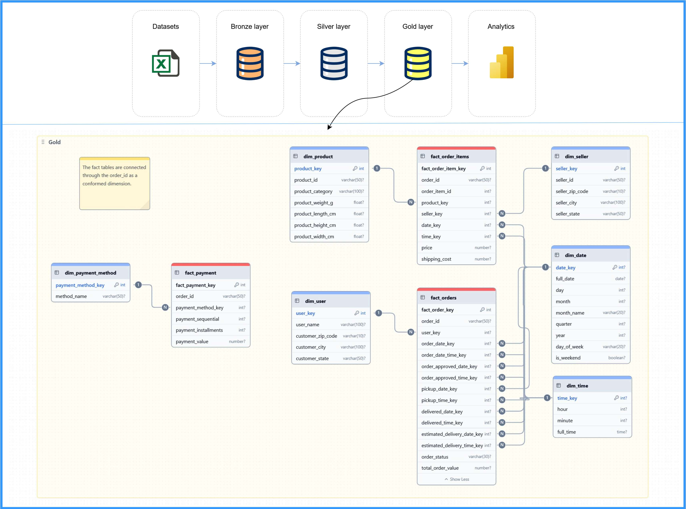
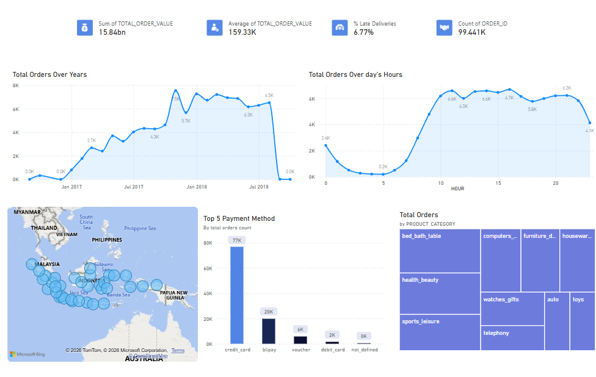

# Ecommerce Data Warehouse & Analytics Project

## 📌 Project Overview
This project demonstrates an end-to-end **modern data engineering and analytics workflow** for an ecommerce platform.  
It covers data ingestion, transformation using a **Bronze–Silver–Gold architecture**, business analysis using **SQL**, and interactive visualization using **Power BI**.

The goal is to transform raw transactional data into **business-ready insights** that support decision-making across sales, logistics, payments, and customer behavior.

---

## 🏗️ Architecture
The project follows a layered data warehouse design:

- **Bronze Layer**: Raw ingested data
- **Silver Layer**: Cleaned, standardized, and normalized data
- **Gold Layer**: Business-friendly fact and dimension tables optimized for analytics

📊 The full workflow is illustrated below:



---

## 🛠️ Tech Stack
- **Data Warehouse**: Snowflake
- **SQL**: Data modeling & analytics
- **BI Tool**: Power BI
- **Storage**: CSV datasets at stage layer
- **Modeling**: Star schema (Fact & Dimension tables)

---

## 📂 Repository Structure
```
│ README.md
│ analysis.md
│ diagram_workflow.jpg
│
├── analytics
│ ├── dashboard
│ │ ├── overview_dashboard.png
│ │ └── power_bi_dashboard.pbix
│ │
│ └── sql
│ ├── 01_peak_season.sql
│ ├── 02_user_activity_time.sql
│ ├── 03_payment_methods.sql
│ ├── 04_installments.sql
│ ├── 05_purchase_frequency_by_state.sql
│ ├── 06_logistics_routes.sql
│ └── 07_late_deliveries.sql
│
├── datasets
│ └── *.csv
│
└── data_engineering
│   ├── bronze
│   ├── silver
│   └── gold
```

## 📊 Dashboard Preview
The Power BI dashboard summarizes key KPIs and trends:



---

## 📈 Key KPIs
- Total Revenue
- Total Orders
- Average Order Value
- % Late Deliveries
- Peak Ordering Hours
- Preferred Payment Methods
- Logistics Traffic Routes

---

## 🚀 How to Use
1. Load datasets into Snowflake (Bronze layer)
2. Run Silver and Gold transformation scripts
3. Execute analytics SQL queries
4. Open the Power BI dashboard (`.pbix`) to explore insights

---

Built with ❤️ by **Ali Adel**  